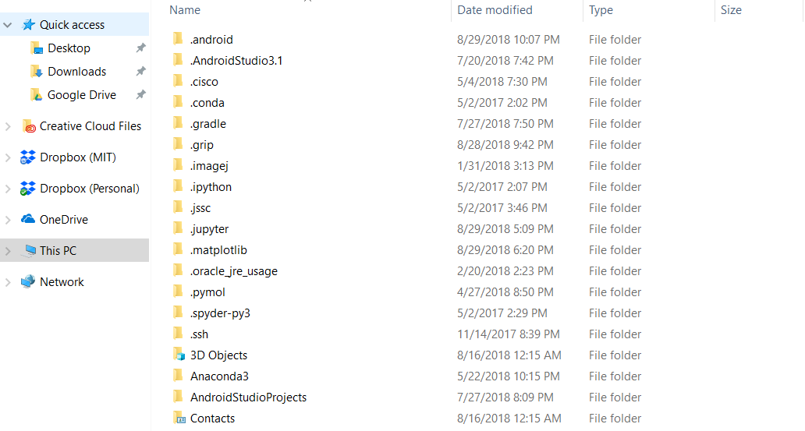
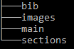
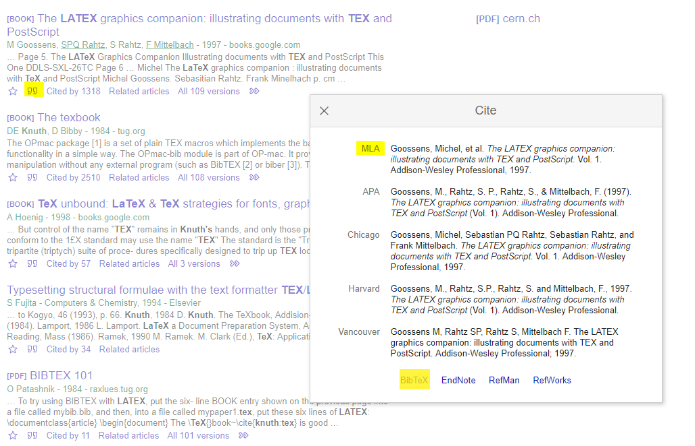
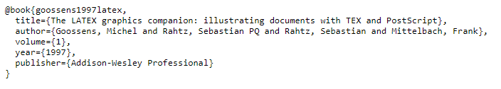
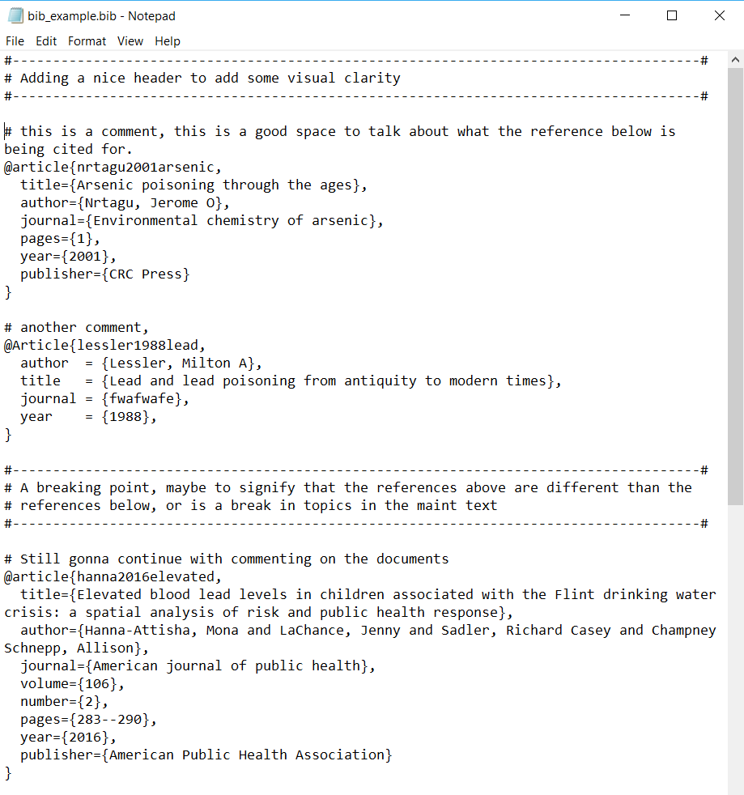

<!-- TOC -->
<!-- https://ecotrust-canada.github.io/markdown-toc/ -->
- [TL;DR](#TL;DR)
- [Getting started](#getting-started)
  * [Setting it up](#setting-it-up)
  * [Downloads](#downloads)
- [Things to know (in general) before diving in](#things-to-know--in-general--before-diving-in)
  * [Knowing what _paths_ are](#knowing-what--paths--are)
  * [How to navigate](#how-to-navigate)
- [The makeup of a LaTeX document](#the-makeup-of-a-latex-document)
  * [The document class](#the-document-class)
  * [The preamble](#the-preamble)
  * [Images](#images)
  * [Bibliogrpahy](#bibliogrpahy)
    + [Manual insertion](#manual-insertion)
    + [Biblatex (\& Natbib)](#biblatex-----natbib-)
    + [Where to get .bib files](#where-to-get-bib-files)
  * [Breaking it down](#breaking-it-down)
    + [\input \& \include commands](#-input-----include-commands)
    + [\subfiles](#-subfiles)
    + [How to reference subfiles, whether using \input or \subfiles, with one another](#how-to-reference-subfiles--whether-using--input-or--subfiles--with-one-another)
    + [Another file structure](#another-file-structure)
- [How to compile](#how-to-compile)
  * [Basic compilation (for Texmaker)](#basic-compilation--for-texmaker-)
  * [Bibliograph compilation (for Texmaker)](#bibliograph-compilation--for-texmaker-)
 <!-- \END TOC -->

# TL;DR
- Download MikTeX and a tex IDE such as Texmaker
- Download the files in folders titled eithre "Thesis Proposal" 1, 2, or 3 depending on your preference or needs
- Load the main.tex file, found in the main folder, in your IDE of choice 
- Using Texmaker, press F6, or the Quikbuild icon at the top of the IDE to compile the code
- Press F7, or alternatively open the pdf file that is made from the compilation.
- Edit as necessary

# Getting started
There are two fundamental categories for digital document writing. The first is plain text, where formatting is done through code. The second are word processors, documents that hide most to all of the formatting away from the user such that they experience an interface known as WYSIWYG (what you see is that you get), where bolded words are literally bolded on your document.

LaTeX  is one of the more sophisticated types of document writing, plain text using markup tagging to define general structure and code for the document. For example, `\textbf{XYZ}` means to bold *XYZ*. What
makes LaTeX  an attractive platform for document writing is control and consistency. We will see the power of LaTeX eX as we go further in this README, and hopefully show you the benefits of learning such a powerful word editing tool.

## Setting it up
There are two pieces to setting up LaTeX on your local computer
* A LaTeX  compiler (for either Windows or Mac). This takes what you write, and converts it into a clean and professional document.
* Optional, although highly recommended, a LaTeX  IDE (integrated development environment) where you can type and compile your code in one software enviornment (much like using Word).

## Downloads
* LaTeX  compiler
	- PC: [MikTex](https://miktex.org/download)
	- Mac: [MacTex](http://www.tug.org/mactex/)
* LaTeX  IDE (in order of _my_ preference)
	- [TeXmaker](http://www.xm1math.net/texmaker/)
	- [TeXstudio](https://www.texstudio.org/)
	- [TeXworks](http://www.tug.org/texworks/) (this is automatically installed with most TeX compiler installations)

To avoid a long step-by-step guide on downloading these packages, I will instead refer you to easy to follow online videos, courtesy rof YouTube.
* For windows: [both MikTex \& Texmaker](https://www.youtube.com/watch?v=WnIYTFTsWiU)
* For mac: [mactex](https://www.youtube.com/watch?v=XlxiytGeWds) \& [Texmaker](https://www.youtube.com/watch?v=-KgxKA-UBh4)

# Things to know (in general) before diving in
Here are some pointers about, well, computers in general before you get too lost into the world of LaTeX. If you are a computer savant, please go ahead and skip this; but if you are one who needs a mouse to click through your computer and feels lost otherwise, then please read on.

The first are paths. Typically all operating systems will have a GUI that lets you click through folders to access other folders or files. Much like the PC file explorer below:

<div align="center">	

</div>

LaTeX, and mostly all code-based software don't have this GUI interaction. However, knowing where your documents and files are stored is essential, so we have to follow some rules and master file navigation without a GUI.

## Knowing what _paths_ are
So instead of clicking your way through folders, you have to instead tell (_aka_ manually type out) the path that you want to go to. Much like giving directions to your computer. However, much like navigation, directions are relative to where you are. The directory (i.e. folder) you are currently located in is called the _*root*_ directory; however, if you jump to another directory, the new directory is now your _root_ directory.

The computer itself (irregardless of you) has it's own _root_ directory, or a location it defaults to when a user is not around to specify a place to live. For Windows, the computers root directory is typically a disk partition, known as a drive, such as the _C:\\_ drive. For a Unix like system such as Mac or Linux your root is simply _/_. Although beyond the scope of this discussion, you can store directories into variables to avoid the constant (and typically error-prone) typing, these are called _path variables_ and have names (in Windows) such as `%HOMEDRIVE%` or (in Mac) `$HOME` (or shortly known as `~`). This is completely optional, and may get you more confused; however if you want to learn more please [read online](https://superuser.com/questions/284342/what-are-path-and-other-environment-variables-and-how-can-i-set-or-use-them). 

## How to navigate
To navigate through these directories is much like reading a list of directions. Therefore there are two ways to approach file navigation. The first is relative, and the second is absolute (i.e. static). Relative navigation, which is the preferred way to navigate is to travel from where you are now to where you want to be (relative to you). Absolute navigation will use a known location irregardless of where you are, such as the computer's root directory or a path variable, and go from there. It is static, because you can be whereever in the computer file system, but the root directory or path variables don't change.

In code lingo you, you declare these directions with the symbnols below:
* `.` = current directory
* `..` = the directory above me
* `/` = designates a folder (note that Windows does the opposite `\`, we will not use this notation as its confusing and not conventional, and is reserved for calling functions in LaTeX)

Say you are currently in a directory called _Thesis_ with a folder structure as illustrated below. 

\>_Thesis directory_ :\


Let's say I am currently in the main folder, and I want to travel to the images folder to retrive an image. In order to do that relatively I would type 

```bash
../images
```

Which means from where I am now (_main_) I want to move up one folder (`..`), then down into the next folder (`/`) called _images_. 

Say I want to do this statically, such that I don't care where we are. I would instead write (for Windows)

```bash
C:/Users/GeorgeSun/Thesis/images
```

In this case I start at the very tip (_root_ folder of the computer) and travel my way down to the _images_ folder. Quite a lot of typing, so we rarely use absolute navigation. More so, if I want to share with you my files, these navigations would break, as your file system may not contain the file system I have, especially if your username isn't GeorgeSun.

One downside to relative imports is that, well, it's relative. If you move somewhere else and use the same path navigation it won't work. But there is a few tricks we can do. Here's a brain teaser. Let's say I am in the _sections_ folder and I want to get a file in the _main_ folder. In the same situation, let's say I am already in the _main_ folder and want to grab a file where I am currently in (_main_). You can write two separate path navigations:

If I am in the _sections_ folder
```bash
../main/example_file.tex
```

If I am in the _main_ folder (no need to move anywhere)
```bash
example_file.tex
```
or verbosely
```bash
./example_file.TeX
```

Let's say I give you one constraint, and that is to say you have to write one path navigation for both of these files. What do you do? One way is to make a static navigation, as it doesn't matter where you live; however this is not recommended. The preferred method is to go up as many directories as you can until you reach a "_root-like_" folder, or in this case the _Thesis_ folder which is the _root_ folder for the four folders mentioned. Here's the answer, think about it.

```bash
../main/example_file.tex
```

The goal is to navigate to the _Thesis_ directory (`..`) and down the path you want. For both scenarios, if I live in the _sections_ directory, using the navigation path I move up one (to the _Thesis_ direcotry) and then down into the _main_ directory where I can located whatever I want in _main_. If I live in the _main_ folder, although somewhat redudant, I move up one directory to _Thesis_, and then back into main to then get the same file. So one path works for both cases, and this is a strategy used in the LaTeX heiarchy structure I provide. 

# The makeup of a LaTeX document
Setting aside the syntax and coding of a LaTeX document, let's learn more about how to structure and assemble the document. You can create a LaTeX document in one giant file, but we are better (and smarter) than that. Instead is to modularly build up our document in a divide-and-conquer approach and handle each part peice-by-peice.


 This is where most of the work comes into play when customizing a certain document style. 
To set your document up, there are some paths you need to be familiar with
- Setting up your document class
- Where is your preamble, titlepage, etc.
- Where are your images
- Where are your bibliographies
- Where are your subfiles (if any)

## The document class
```tex
\documentclass[a4paper]{article}

#... (preamble)

\begin{document}

#... (document content)

\end{document}
```

The `\documentclass[options]{class}` is extremely powerful when setting up your document. It comes with options and class parameters. Class documents relevant to scientific writers are:
* article : for scientific journals and reports
* report : for longer reports containing chapters, small books, or even a thesis
* book : for books

And the options class establish a ruleset that your document will follow unless overriden in the contents:
* 10pt, 11pt, 12pt, etc. font sizes
* a4paper, letterpaper, etc.
* twocolumn
* landscape

So for example I want to write a article in a scientific journal that requires 12 pt font, two columns, on default paper size (letterpaper), then your document class will look like

```tex
\documentclass[12pt, twocolumn, letterpaper]{article}
...
\begin{document}
...
\end{document}
```

## The preamble
The preamble contains all the packages that make your document either easier to write, or flashy when compiled. The preamble will typically contain a laundry list of `\usepackage[]{}` statements that will import packages that further customize your document. For example, the package [_mathtools_](), [_amssymb_](), and [_amsfonts_]() are all used to help generate nice looking math fonts and symbols. Typically your IDE (e.g. TeXmaker) will take care of downloading all the packages needed to render your document from the interent. However, if you are missing a package, you may need to manually download it yourself. To do so, you need to go directly to the tex compiler and tell it what package you need. 

To avoid clutter, all packages can be collected into a _preamble.sty_ file which only holds package references and other modifications to the entire document class. To then use the _preamble.sty_ file into the actual document, you import the _preamble.sty_ file like any other package. Essentially, you are making one package that gets imported which imports all the packages you want. To do this you need two parts.

In the preamble header you write

```tex
\ProvidesPackage{preamble}
```

and in the document you import it as 
```tex
\usepackage{preamble}
```

## Images
As a general note, do not put spaces in any file you name, if possible. This is especially true for image names, since importing images from other files which contain spaces will lead to trouble. If you do have spaces in your images (again, try to avoid this), you can add a package called [grffile](https://ctan.org/pkg/grffile?lang=en) that will behind the scenes remove all spaces in your image file directories so you can use spaces in your image names. So in your preamble you should include

```tex
\usepackage[space]{grrfile}
```

[graphicx](https://ctan.org/pkg/graphicx?lang=en) package

```tex
\usepackage{graphicx}
\graphicspath{{../images/},{../../images}}
```

To then tell

## Bibliogrpahy
Arguably one of the most important, but often the most overlooked and shrugged off section of a scientific document in terms of formatting and organizing. The bibliography in LaTeX may seem confusing at first, but once running it becomes easy to scale and format. There are two methods to insert bibliographic references in LaTeX and that is manually, or automatically using a database of _.bib_ files generated either by you or a software package (e.g. Zotero, Mendeley, etc.). Bibliographies are created with unique IDs and the affiliated bibliographic content. The ID is conventionally formatted with the lead author's last name, followed by an \_ and the publication date. This ID is then used to reference the article using the command `\cite{ID}`. The beauty in this referencing style is that even if you change the bibliographic content, rearrange the ordering, or even move the cite command to another location, LaTeX will compile and link everything appropriately without you have to deal with relabeling or renumbering references.

To cite multiple references simply add commas between IDs `\cite{ID1,ID2,ID3}`.

Although not always used, if you want to force a bibliography entry without actually citing that reference. In other words, making a reference appear in the bibliography when it is not referenced in the main text, you can use the `\nocite{ID1,ID2,...}` command.

### Manual insertion
The easiest to use, yet most difficult to scale, is to manually insert bibliographic references. You have to provide the unique ID and the appropriate bibliographic format yourself. To do this, you set up a bibliography enviornment `\begin{thebibliograph}`. 

```tex
\begin{thebibliography}{99} 
\bibitem{unique_ID}
This is whatever format you want, including styling and whatnot.
```

Note that the `\begin{thebibliograph}{#}` contains a number parameter. _\#_ is how many references you expect to have, where the number of digits represent the number of entries (rather than the number itself, oddly). So 11 and 99 represent at least 99 items (double digit values), and 1,2,3...9 all mean at most 9 items (single digit values). When compiled, the reference you have below the `\bibitem` is literally copied and pasted into the document, so you provide the formatting and consistency.

To reinforce the message, _you_ have to provide the appropriate bibliogrpahy style. The bibliography enviornment will only link your `\cite{}` commands to the appropriate bibliography number

### Biblatex (\& Natbib) 
The power of using LaTeX built-in (and package-dependent) bilbiography engine, Biblatex, is that formatting, numbering, and referencing are all automated, or quickly changed by changing a few arguments in the preamble. To start, we will go over the [_natbib_](https://ctan.org/pkg/natbib?lang=en) package that supports easy formatting and automation when numbering and ordering references. Because natbib is a package, you import it and declare any relevant options in the preamble.

```tex
\usepackage[options]{natbib}
```

Examples of options are
* how citations appear:
	- **numbers**: for numerical citations (e.g. Nature papers)
	- **authoryear**: (default) citations appear as author year (e.g. Cell papers)
* how citations are enclosed:
  - **round**: (default) for round parentheses
	- **square**: for square brackets
	- **curly**: for curly braces
	- **angle**: for angle brackets
	- **super**: for superscripted numerical citations (e.g. Nature)
* how multiple citations are separated 
	- **colon**: (default) to separate multiple citations with colons
	- **comma**: to use commas as separaters
* how citations are ordered:
	- **sort**: orders multiple citations into the sequence in which they appear in the list of references;
	- **sort\&compress**: as sort but in addition multiple numerical citations are compressed if possible (as 3-6, 15);
	- **longnamesfirst**: makes the first citation of any reference the equivalent of the starred variant (full author list) and subsequent citations normal (abbreviated list)
	- no arguments (default): orders on alphabetical order 

For example, say I want to format my bibliographies and citations by numerical indexing, as a superscript, separated by commas, and sorted. E.g. like this<sup>1,2,3</sup>.

```tex
\usepackage[numbers,super,coma,sort]{natbib}
```

Still have the battle for formatting! You have the aesthetics, but not yet the bibliography formatting. To control the bibliography formats, you can use `\bibliographystyle{style}`.  Where the style option is how the bibliogrpahy entry is formatted, e.g. how author, years, journal numbers or organized and abbreviated, if at all. The number of styles are in the double digits, so please refer to the attached pdf _bibliography.pdf_ which contains 44 possible styles. 

Even though the number of styles, and how the styles are formatted may be daunting, all you need to do on your end is to change the argument in _bibliographystyle_ and everything should reformat itself!

Finally is to include the bibliographies. This will require the help of the bibtex engine which will import your database of bibliographies, format it to whatever style you want given _bibliographystyle_, and link any _cite_ commands to the numbering system you imposed given _natbib_. To include your database of bibliographies, you simply use:

```tex
\bibliography{bib_example}
```

Where _bib\_example_ is a _.bib_ file containing a list of bibliography entries. The nice thing about this command is that you can continue to add bib files. Say you have a references in the introduction, some in the methods, and some in the discussion. You can divide-and-conquer and separate those bibliographies into separate files, maybe named _intro\_bib.bib_, _methods\_bib.bib_, _discussion\_bib.bib_, and so on and add them into the arguments of `\bibliography{intro_bib,methods_bib,discussion_bib}`. Note, no spaces between files!

### Where to get .bib files
You got the formatting all set, now the question is how to generate your own bibliography database. One way is to go to google scholar and search for the article, and use the citation icon to select the format you want, either provided in the dialogue box scholar provides or specifically selecting the BibTeX link.
 
Clicking on the BibTeX format you will be directed to a window containing the text of the bibliography. You can copy and paste this into an existing .bib file. As an aside, if you are just making your .bib file, you can save an empty text document, then go back and rename the entire file name to have a .bib extension than it's original .txt extension. By entering your .bib files into a text document (with a .bib extension) you can add comments and notes to yourself on what each entry is and how it's related to your main text. I tend to use '%' much like commenting in a LaTeX document when entering comments. 

<div align="center">	

</div>

Another way is to curate the .bib files using a citation software such as Zotero, Mendeley, or OneNote. Please refer to their specific software guidelines for exporting selected .bib files from your collections.

Lastely is to generate the database yourself using a combination of both methods above, from your own searches and from 3rd party software. Once you have the .bib database you want, you can clean it up, check for errors, or even do all the bookkeeping in a .bib focus software package called [Jabref](http://www.jabref.org/). Jabref is essentially Zotero/Mendeley/etc. but specifically for managing .bib files and seamlessly integrating your references into your LaTeX document.

<div align="center">	

</div>

## Breaking it down
Whether writing a large lab report, thesis, or book, or even sharing parts of the document with co-authors to separately write an article, a LaTeX document can get large fast. In order to modularize and separate the pieces, LaTeX comes with useful functions that allow you to write parts/sections/chapters of the document in pieces. There are two flavors to piece-meal your document. The first is to use built-in packages such as `\input` and `\include`, and the second is to use more advanced packages that allow you to compile each section piece-by-piece and then combine them altogether when you are ready.

For either preference, you need to organize your file structure intelligently; this is where paths come in, and your knowledge of them will greatly speed-up your workflow. The method I employ to break-up my document is to use the file structure below. 

<div>	

</div>

\> _root directory_&nbsp;
* **bib**
	- bib_example.bib
* **images**
	- img_example.jpg, etc.
* **main**
	- main.tex
	- titlepage.tex
	- premable.sty
	- refextdoc.sty
* **sections**
	- section 1
	- section 2
	- ...
* **tables**
  - table.tex, etc.  

The take away is that there is a main document called _main.tex_ which will act as a linker that pulls in different components of the LaTeX document, e.g. the preamble, the titlepage (optional), a refextdoc (reference external document) package that allows you to cross reference your sections (more on this later), and finally a completely new directory containing all the sections that make up the content of your document, which we will call subfiles.

### \input \& \include commands
Both `\input{filename}` and `\include{filename}` both take a separate file, i.e. _filename_ and literally copies and paste its content to the main document.

| \input | \include |
|--------|----------|
| can nest multiple \inputs within documents | cannot nest \includes within a document |
| no page break | will force a page break |
| optional _.tex_ extension | do not use _.tex_ extension, will not compile |

Because the main file will copy the contents from the subfile into itself, when referring to external resources _within_ the subfile, such as images, tables, bibliographies, etc. you need to use relative paths that _start_ in the main folder. Quite literally, when compiling the LaTeX compiler will move the code from the subfile into _main.tex_ so all relative paths start in the _main_ folder.

The examples use `\input`, in order to avoid the pagebreak introduced by `\include`, but the two commands are interchangeable depending on your circumstances.

One disadvantage of using this method is that you cannot independently render a subfile, say if you have 10 subfiles you need to compile the main document to see all 10 subfiles render. To see an indvidual subfile, you would have to input or include that subfile individually, which can be tedious if you want to check 10 separate subfiles. Therefore, there are more advanced functionalities to compile subfiles individually, which is shown below.

### \subfiles
There are two ways to include subfiles into a main document while also having the ability to compile them individually to check their output and style. There are two ways, `\subfiles` and `\standalone`. The discussion of whether to use one or the other is beyond the scope of this introduction, and is up to preference as well, but to make a choice I will show you examples of how to use subfiles.

The [subfile package](https://ctan.org/pkg/subfiles) allows you to compile your subfiles independently of the main document. This means you can view the changes and style output of your subfiles on the fly, and then combine them into your main document when you are ready. First you need to import the subfile package using `\usepackage{subfiles}`. Afterwards, to use the subfile package

 works is to link the preamble, and any other document modifications, into a subfile which is then used to render it. How this works is that your subfile will contain a "document class-like" heading shown below.

```tex
\documentclass[../main/main.tex]{subfiles}
\begin{document}
... content of subfile
\end{document}
```

where `/path/to/main` is a relative path to the main document in order to take it's preamble. For main, to include the subfile you use

```tex
\subfile{../sections/subfile}
```

There is a few weird quirks in using \subfiles, in particular for this file structure. The quirk is that the main document is doing its own imports of documents essential for the subfile package. In this case, the _preamble.sty_ and _refextdoc.sty_. So the question is, how can I write one navigation path that can work for main, and the subfile documents? Sound familiar, the answer is below:

```tex
\usepackage{../main/preamble}
\usepackage{../main/refextdoc}
```

You go up to the root directory (`../`) which contains the main, sections, images, etc. folders, and then go back down to main to access the preamble, refextdoc, or whatever else you need. Both main and the subfiles can use this path and they will end up retrieving the same document.

### How to reference subfiles, whether using \input or \subfiles, with one another
Because you have subfiles located in separate parts of your file structure the referencing engine of LaTeX will get lost. For example, say you have an equation in _subfile1.tex_ and that equation needs to be referred later in the document in _subfile4.tex_, the LaTeX compiler needs to know how to refer to that equation. In order to help LaTeX cross reference pieces of the document that are divided into subfiles you need to use the _xr_ package, e.g. `\usepackage{xr}`. To tell the _xr_ package where to look you provide an external document argument `\externaldocument{path/to/other/subfiles}`. As a naming convention, I put all `\externaldocument{}` statements into a separate file called _refextdoc.sty_ which is imported with the main.tex document, much like the _preamble.sty_. In the _refextdoc.sty_ you will see code like

```tex
\ProvidesPackage{refextdoc}
\usepackage{xr} 

% for main document
\externaldocument{../main/main}
\externaldocument{../sections/subfile1}
\externaldocument{../sections/subfile2}
```

### Another file structure
The first question is, why use the file structure provided? The answer is that besides imports of the preamble and refextdoc quirk, all other imports are straightforward. So importing images, tables, bibliographies, or any other file, the path for main or the subfile is the same.

For example, an alternative file structure is below where the **_sections_** folder is within the main folder. Although not that different from the structure above, it does cause some relative path disruptions (your code will not compile). 

root&nbsp;
* **bib**
	- bibliography.bib
* **images**
	-image 1, etc.
* **main**
	- main.tex
	- title_page.tex
	- premable.sty
	- refextdoc.sty
	- **sections**
		- section 1
		- section 2
		- ...

Fixable! In particular for images, you can use the _graphicspath_ package. In this case, you would have to duplicate the paths to the images folder using.

```tex
\graphicspath{{../images/},{../../images}}
```

If you are using `\input` instead, then really no changes need to be done on the subfiles, as they should all have relative paths with respects to the main document, which in this case hasn't moved. So instead, the main file needs to update it's relative paths to the subfiles which would be

```text
\input{\sections\subfile1}
```

which is simply transversing down the sections directory.

Where `../` is for the main document, and `../../` is for the subfiles (they live 2 directories deep, rather than 1 for the main document). Importing other resources such as bibliographies, tables, etc. will require additional work, and will leave that up to the reader.


# How to compile

## Basic compilation (for Texmaker)
Quickbuild allows you to compile using default settings. The Quickbuild option can be modified in settings 

If using Texmaker, you can press F6 to compile
You can then visualize the compiled document using F7. If there are question marks or errors 

## Bibliograph compilation (for Texmaker)
Pulling all of the pieces for building the tex document, inlcuding the bibliographies, external references, table of content, images, and tables requires some bit of work on the compiler side. Therefore, to compile the entire document correctly there are a few compilation hoops to go through. They are

- make an initial compilation (PdfLaTeX)
- compile the bibliographies (Bib(la)tex)
- combine the compilations made from the bibliographies and pdf, but do this twice! (PdfLaTeX x2)
- view the pdf

Because these commands are a hassle to do individually, you can program the Quick Build command to perform all said tasks at a click of the button. Therefore, the commands F6 and F7 to perform basic compilation and viewing can be done for debugging purposes, but for finalizing and submitting the document use the QuickBuild command locate at the top of the TexMaker IDE.


